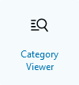
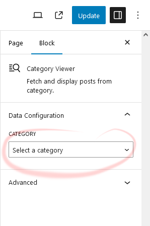
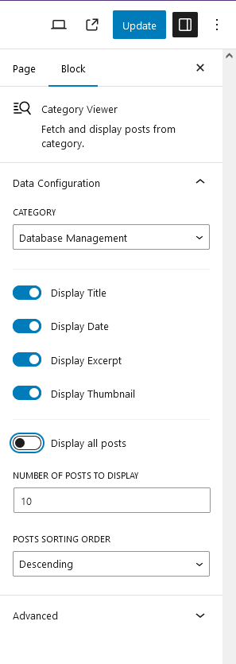
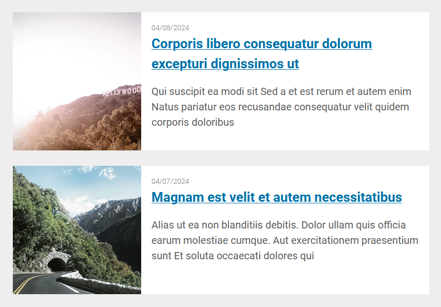
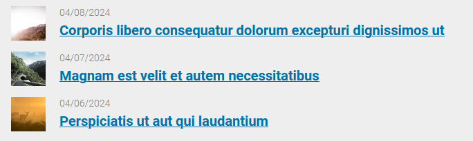
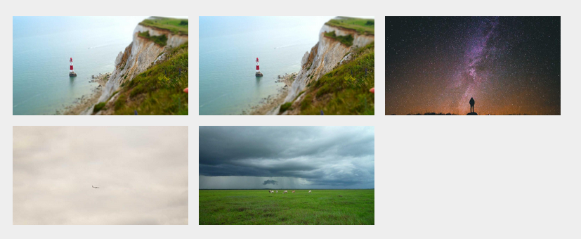

## Medior Challenge: Fetch & Display Dynamic Content

**Points: 2**

### Task:

Create a block that fetches and displays posts from a specific category dynamically.

### Requirements:

Have a dropdown that shows categories on the side panel,

Display fetched posts within the block (It can be only a linked title or more info if you want). 
[README.md](..%2Ftask_01%2FREADME.md)
### Starting Tips:

1. Use ServerSideRender to render the posts,

2. Use apiFetch to get categories for displaying in the side panel,

3. Use the default REST API endpoints to fetch categories or create your own.

## MY SOLUTION:

### Installation

1. [Download](./dist/category-viewer.zip) the ZIP file of the plugin from the `./dist` folder
2. Log in to your WordPress admin dashboard
3. Go to `Plugins > Add New Plugin` and click on the "Upload Plugin" button
4. Choose the downloaded ZIP file from your computer and click "Install Now"
5. After installation, click on the "Activate Plugin" of the **Category Viewer** plugin

### How to use

1. From the **Gutenberg editor**, open the block inserter tool to add a new Block.
2. You will see various options for different types of blocks categorized into sections.
3. Access the "WordPress Challenge" category
4. Click on the "Category Viewer" icon to insert the block that will allow you to view the posts related to a category.

5. Once the block is inserted, a zone will be shown with the message *"No Posts Found"*.
Don't worry, it's normal. You only have to select the category from which you want posts to be displayed in the settings panel.
Once it is done, the posts associated to the category will be shown.

#### Customization
The "Settings Panel" allow you to customize:
- The number and order of posts
- How the posts are displayed

#### Displaying Title / Date / Excerpt / Thumbnail

#### Displaying Title / Date / Thumbnail

#### Displaying Thumbnail Only

