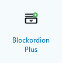
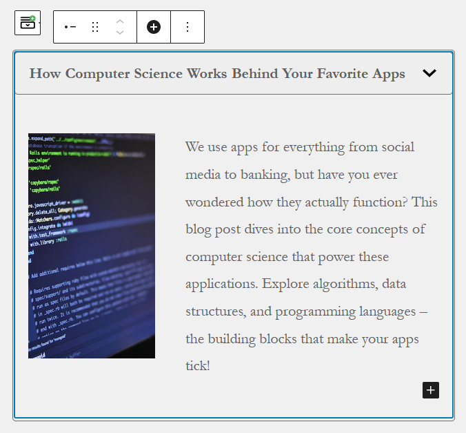
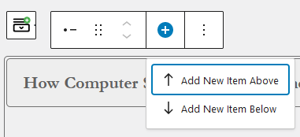
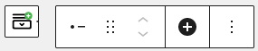

## Blockordion Plus

This WordPress plugin project represents my response to the 'Senior Challenge - Accordion Block - Part 2.
The project is a bit similar to "Blockordion" project. The project enables users to use an Accordion Block capable
of managing multiple toggleable items. Unlike the initial project, this version allows for diverse content types in the
body, not limited solely to rich text.

## Features
Unlike the first project (Blockordion), this plugin takes advantages of the InnerBlocks Gutenberg feature.
This allow us to use native solutions already implemented. For example, drag and drop feature is already
supported and doesn't need to be re-implemented.

The use of nested InnerBlocks also allow us to add any content types in the body.

## Installation

1. Obtain the plugin zip file located at `./dist/blockordion-plus.zip`
2. Log in to your WordPress admin dashboard
3. Go to `Plugins > Add New Plugin` and click on the "Upload Plugin" button
4. Choose the downloaded ZIP file from your computer and click "Install Now"
5. After installation, click on the "Activate Plugin" of the Category Viewer plugin

## Usage

1. From the Gutenberg editor, open the block inserter tool to add a new Block.
2. You will see various options for different types of blocks categorized into sections.
3. Access the **"WordPress Challenge"** category
4. Click on the "Blockordion" icon to insert the accordion block.

   

5. Customize the title and body content of the item. This time, you can add any types of content in the body such as
   columns, images etc. A paragraph block is available as the body content by default. But you can customize it and add
   more contents by clicking on the "+" button on the bottom right.

   

6. Add new items to the accordion block through:
    - A button on the Blockordion toolbar
    - A button on the item toolbar

   

7. Rearrange items by grabbing their drag handle on the item toolbar or just click on the up and down arrow next to it.

   

8. If needed, also delete items through the submenu.
9. Save or update your post or page.
