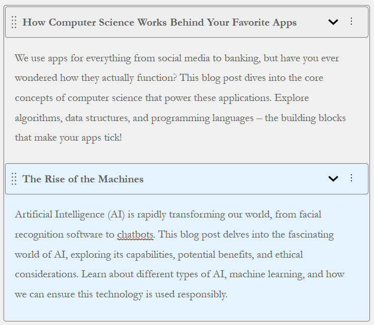
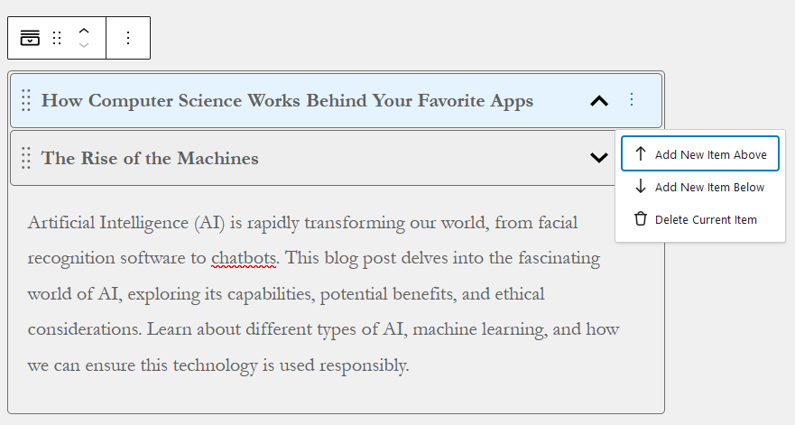
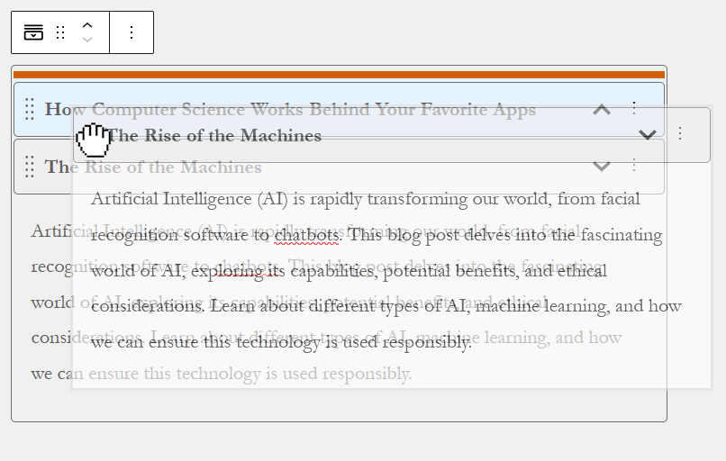

# Blockordion

This WordPress plugin project is my solution for the "Senior Challenge - Accordion Block - Part 1".
The challenge consists in creating an Accordion Block that may contain multiple items that can be toggled.

For this Part 1 of the challenge, the body exclusively utilizes Rich Text and does not incorporate any other content
types.

## Features

- **Title and Body Content**: Each item in the accordion can have a custom title and rich text body.

- **Items added or removed directly via a menu in the editor and not Inspector panel**

- **Drag-and-Drop Interface**: Easily rearrange items within the accordion.

## Installation

1. Obtain the plugin zip file located at `../dist/blockordion.zip`
2. Upload the zip file through the WordPress admin interface (`Plugins > Add New > Upload Plugin`).
3. Activate the plugin.

## Usage

1. Add the Accordion Block to your post or page using the Gutenberg editor.
2. Add multiple items to the accordion.
3. Customize the title and body content for each item.
4. Rearrange or delete items as needed.
5. Save or update your post or page.

