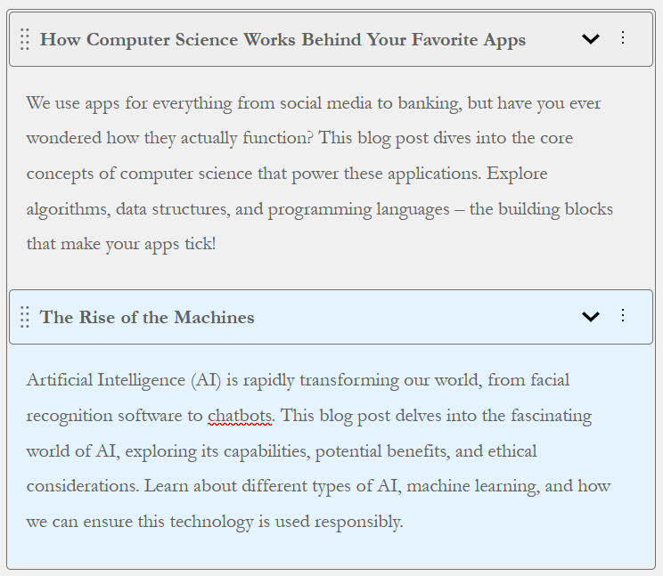
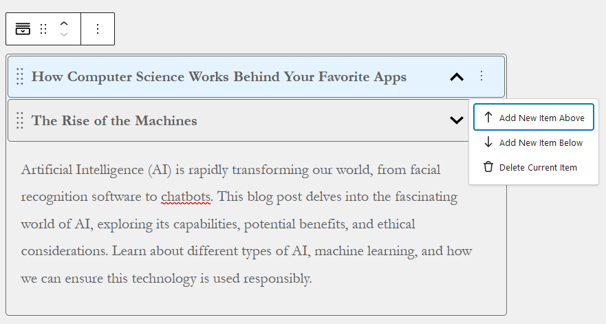
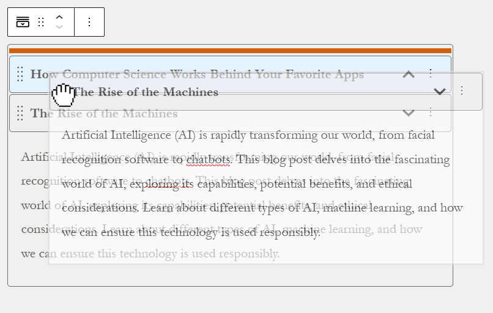
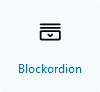
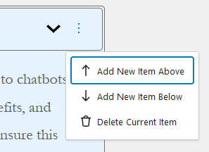
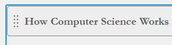

# Blockordion

*(Challenges proposed by [https://www.wpchallenges.com](https://www.wpchallenges.com/))*

This WordPress plugin project is my solution for the "Senior Challenge - Accordion Block - Part 1".
The challenge consists in creating an Accordion Block that may contain multiple items that can be toggled.

For this Part 1 of the challenge, the body exclusively utilizes Rich Text and does not incorporate any other content
types.

## Features

- **Title and Body Content**: Each item in the accordion can have a custom title and rich text body.

- **Items added or removed directly via a menu in the editor and not Settings panel**

- **Drag-and-Drop Interface**: Easily rearrange items within the accordion.

## Installation

1. Obtain the plugin zip file located at `./dist/blockordion.zip`
2. Log in to your WordPress admin dashboard
3. Go to `Plugins > Add New Plugin` and click on the "Upload Plugin" button
4. Choose the downloaded ZIP file from your computer and click "Install Now"
5. After installation, click on the "Activate Plugin" of the Category Viewer plugin

## Usage

1. From the Gutenberg editor, open the block inserter tool to add a new Block.
2. You will see various options for different types of blocks categorized into sections.
3. Access the **"WordPress Challenge"** category
4. Click on the "Blockordion" icon to insert the accordion block.

   

5. Customize the title and body content of the item.
6. Add new items to the accordion block through the item submenu.

   
7. Rearrange items by grabbing their drag handle and dropping them above another one.

   

8. If needed, also delete items through the submenu.
9. Save or update your post or page.
