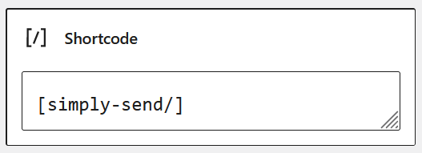
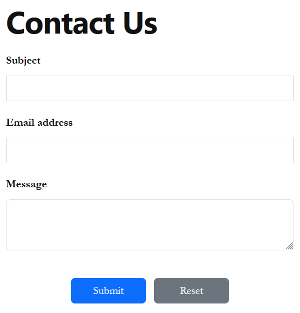
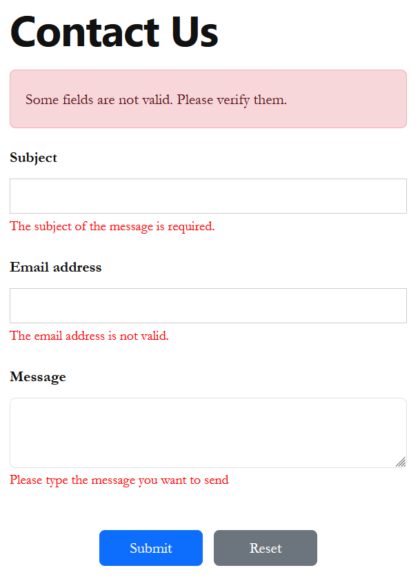

# Junior Challenge: Form as Shortcode

*(Challenges proposed by [https://www.wpchallenges.com](https://www.wpchallenges.com/))*

**Points: 1**

## Task:

Develop a shortcode that will output a simple contact form. This contact form, when submitted, will use `wp_mail` to
send
the email.

## Requirements:

- Shortcode needs to have fields: *Subject* (input), *Email* (input), *Message* (textarea),

- Sanitize all fields before being used for sending it,

- Use `wp_mail` to send the email

- Style it and enqueue style only on pages where the shortcode is

- Display errors on top of the form

# Starting Tips:

1. Shortcode docs: https://developer.wordpress.org/plugins/shortcodes/

2. Check if a post has the shortcode: https://developer.wordpress.org/reference/functions/has_shortcode/

## MY SOLUTION:

### Installation

1. [Download](./dist/simply-send.zip) the ZIP file of the plugin from the `./dist` folder
2. Log in to your WordPress admin dashboard
3. Go to `Plugins > Add New Plugin` and click on the "Upload Plugin" button
4. Choose the downloaded ZIP file from your computer and click "Install Now"
5. After installation, click on the "Activate Plugin" of the **Category Viewer** plugin

### How to use

1. Log in to the WordPress dashboard
2. Click on "Pages" or "Posts" and then "Add New" or choose an existing page/post to edit.
3. From the Gutenberg editor, add a new "Block", search for "Shortcode" and select the Shortcode block from the list.
4. In the Shortcode block, enter `[simply-send/]`

    

5. Save your changes by clicking "Publish" or "Update".
6. You will now be able to view the contact form by displaying the page/post.

   

7. Data validation is directly done on the server side.
   
   