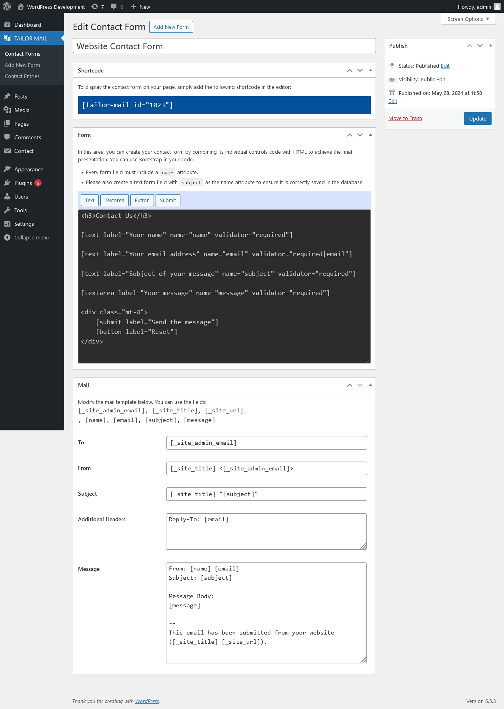

# Medior Challenge: Customizable Form & Saving entries

**Points: 2**

## Task:

Create a customizable contact form so fields can be defined through code & all entries are saved before being sent. A
shortcode will output the contact form, and it will use `wp_mail` to send the email.

Requirements:

- Have a function that will return fields for the contact form

- Render fields from the function

- Add actions before and after rendering fields

- Create a custom post type “Contact Entries”

- Before sending entries, create a custom post type for it

- Change columns of the custom post type for contact entries

## Starting Tips:

1. Use `apply_filters` when returning fields from the function

2. When saving entries:
    - `subject` = post title
    - `message` = post content
    - `email` = custom meta

3. All other fields are also saved as custom meta

4. Creating [custom post type](https://developer.wordpress.org/plugins/post-types/registering-custom-post-types/?utm_source=wpchallenges.beehiiv.com&utm_medium=referral&utm_campaign=wordpress-challenge-2-contact-form-plugin)

5. Customizing [Admin Columns](https://www.smashingmagazine.com/2017/12/customizing-admin-columns-wordpress/?utm_source=wpchallenges.beehiiv.com&utm_medium=referral&utm_campaign=wordpress-challenge-2-contact-form-plugin)

## MY SOLUTION:

### Installation

1. [Download](./dist/tailor-mail.zip) the ZIP file of the plugin from the `./dist` folder
2. Log in to your WordPress admin dashboard
3. Go to `Plugins > Add New Plugin` and click on the "Upload Plugin" button
4. Choose the downloaded ZIP file from your computer and click "Install Now"
5. After installation, click on the "Activate Plugin" of the **Tailor Mail** plugin

### How to use
Before you can display a contact form for the users of your website, you'll need to create it in the WordPress admin. 
To do so, navigate to the "Add New Form" option in the "TAILOR MAIL" menu on the left side.

Upon clicking, a page will appear with several metabox sections to configure your contact form:
- The "Form" metabox section enables you to design the HTML of your form and add control fields.
- The "Mail" metabox section includes a template of the message and information filled by users, which will be sent to you via email.



#### Display all contact forms

You can access a listing of all available contact forms through the "TAILOR MAIL" menu on the left side.


#### Inserting the contact form shortcode
Now that a contact form is configured, you can insert its shortcode into any page or post to display the form to your visitors.


#### The contact form on the frontend
The contact form is now available on the website.


#### Viewing all the contact entries
When a visitor fills and submits a form, its content will be sent to the website admin. Simultaneously, 
the filled form will also be saved as a "contact entry" in a custom post type (CPT). You can view all 
saved contact form messages by clicking on the "Contact Entries" link in the "TAILOR MAIL" 
menu on the left side.


#### View entries for a specific contact form
You can filter the contact entries for a specific contact form by cliking on the "View Entries" link associated with the contact form.


#### View a contact entry


### How the form and control fields work internally
The entire contact form is essentially constructed using nested shortcodes.

First the contact form is accessed via a shortcode formatted as `[tailor-mail id="..."]`, where `id` corresponds to the
ID of the "Contact Forms" custom post type. Next, this post type contains a user defined code that represents the contact form, consisting of 
a mix of HTML and pseudo-shortcodes for each field. 

In the following sections, we will use below contact form as the foundation for our examples.

```
<h3>Contact Us</h3>

[text label="Your name" name="name" validator="required"]

[text label="Your email address" name="email" validator="required|email"]

[text label="Subject of your message" name="subject" validator="required"]

[textarea label="Your message" name="message" validator="required"]

<div class="mt-4">
    [submit label="Send the message"]
    [button label="Reset"]
</div>
```


#### Pseudo-Shortcodes

Each field of the contact form is represented using a pseudo-shortcode, as shown in the example below.

`[text label="Your email address" name="email" validator="required|email"]`

Although it resembles a shortcode, the pseudo-shortcode is not actually officially registered. It will be converted into
a real shortcode during form rendering. For instance, `[text]` will be transformed into `[tailor_mail_text]`. The
pseudo-shortcode is primarily used to simplify the syntax. However, using it might cause conflicts with other plugins
due to its generic naming.

Actually the following control fields are available:
- `[text]`
- `[email]`
- `[textarea]`
- `[button]`
- `[submit]`

#### The [text] control field
The `[text]` control is considered a generic input control, serving as the basis for many other 
input controls such as `[email]`.

`[text label="Your name" name="name" validator="required"]`

Available attributes are:
- `label`
- `placeholder`
- `required`
- `value`
- `name`
- `id`
- `class`
- `validator`

#### The [email] control field
`[email label="Your email address" name="email" validator="required"]`

View `[text]` control for attributes

#### The [textarea] control field
`[textarea label="Your message" name="message"]`

Below is a textarea with default value.
```
[textarea label="Your message" name="message"]
Hello,
I would like some informations about your products.
Thank You
[/textarea]
```

View `[text]` control for attributes

#### The [button] control field
This is the generic control field used for all buttons of the contact form. 

`[button label="Click Here"]`

Available attributes are:
- `type` : button, reset, submit. By default it is `button`
- `variant` : Defines the color of the bootstrap button. Values may be: primary, secondary, success, danger, etc.
- `label` 
- `name`
- `id`
- `class`

#### The [submit] control field

`[submit label="Send the message"]"`

See the `[button]` control for more info.

#### Control validation
*Tailor Mail* takes advantages of the [rakit/validation](https://github.com/rakit/validation) composer package
to validate each control fields. Adding a validation rule to a control field is as simple as including it 
withing the `validator` attribute of the field. If multiple validation rules are needed, add them in their
order of processing and separate them with the `|` symbol.

When choosing a name for your field, it's best to use a clear, single-word name or multiple words 
separated by underscores (_). This name will be used for every validation error message, so the more 
explicit it is, the better the error message will be.

`[text label="Your email address" name="email" validator="required|email"]`

Here are some useful validation rules you can use:
- `required` 
- `email` 
- `uppercase` 
- `lowercase` 
- `alpha` 
- `numeric` 
- `alpha_num` 
- `min:number` : Ex. `min:10`
- `max:number` : Ex. `max:50`
- `between:min,max` : Ex. `between:10,50`
- `url` 
- `date:format` : Ex. `date:Y/m/d` - The default format is `Y-m-d` 

You can view all the available validation rules by visiting the [rakit/validation](https://github.com/rakit/validation) 
documentation on GitHub.

#### Using the "FORM FIELD WIZARD"

Retaining all the syntaxes of the pseudo-shortcode attributes and validators can be challenging. 
To simplify this, you can use the "Form Field Wizard", which provides an interface to easily generate each 
pseudo-shortcode. To access the wizard, click on the toolbar above the contact form code editor and 
select the pseudo-shortcode.


#### Adding programmatically a field to an existing contact form

There are 3 filters that can be used to alter the rendered code of a contact form.
1. `tailor_mail_before_render_contact_form_field` : adds HTML or field before an existing field
2. `tailor_mail_render_contact_form_field` : replaces and existing field
3. `tailor_mail_after_render_contact_form_field` : adds HTML or field after an existing field

```
  add_filter(
      'tailor_mail_before_render_contact_form_field',
      function ( $html, $atts, $content ) {

          /**
           *  inserts a website field before the subject
           *
           *  $atts is the array attribute sent to the current shortcode to be rendered
           *  Array (
           *     [label]     => Subject of your message
           *     [name]      => subject
           *     [validator] => required
           *  )
           */

          if ( $atts['name'] === 'subject' ) {
              return '[text label="Website" name="website" validator="url"]';
          }

          return $html;

      }, 10, 3
  );
```

### Credits

This plugin utilizes the following open-source packages:

- **[rakit/validation](https://github.com/rakit/validation)**: A PHP validation library. Created and maintained by [Muhammad Syifa](https://github.com/rakit).
- **[twig/twig](https://github.com/twigphp/Twig)**: A flexible, fast, and secure template engine for PHP. Created and maintained by [Fabien Potencier](https://github.com/fabpot) and the [Twig Team](https://twig.symfony.com/doc/3.x/contributing.html#the-core-team).

We appreciate the work of these developers and their contributions to the open-source community.

