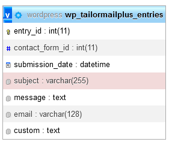
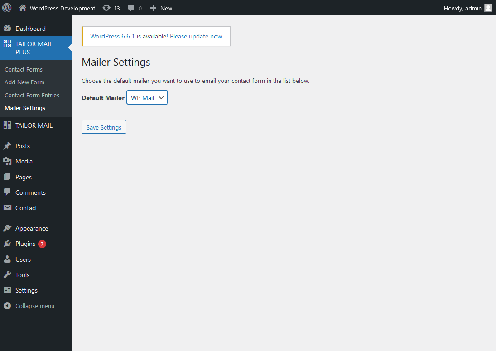
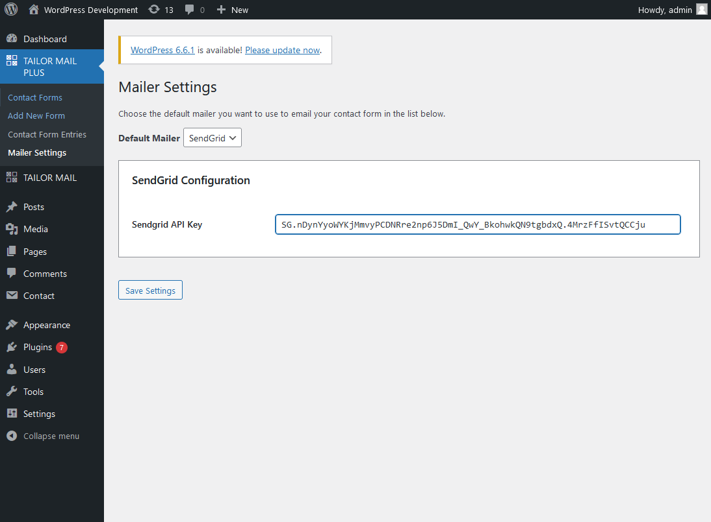

# Senior Challenge: Custom Table & API

**Points: 3**

## Task:

Create a custom table for saving entries instead of CPT and a 3rd party service for sending emails.

## Requirements:

- Create a custom table with columns: subject, message, email & custom (TEXT type and saving other data
  as [serialized](https://www.w3schools.com/php/func_var_serialize.asp?utm_source=wpchallenges.beehiiv.com&utm_medium=referral&utm_campaign=wordpress-challenge-2-contact-form-plugin)
  JSON)

- Admin page to display data from the custom table + delete button to delete the row

- Use **SendGrid** or another service of your choice to send emails (filter out `wp_mail` with SendGrid smtp details OR
  use
  the SendGrid API to send email directly)

## Starting Tips:

1. Check how you can
   create [custom tables](https://wpmudev.com/blog/creating-database-tables-for-plugins/?utm_source=wpchallenges.beehiiv.com&utm_medium=referral&utm_campaign=wordpress-challenge-2-contact-form-plugin)

2. Check code from https://wordpress.org/plugins/post-smtp/ to see how `wp_mail` is being filtered out to send emails
   through different services

## MY SOLUTION:

### Installation

1. [Download](./dist/tailor-mail-plus.zip) the ZIP file of the plugin from the `./dist` folder
2. Log in to your WordPress admin dashboard
3. Go to `Plugins > Add New Plugin` and click on the "Upload Plugin" button
4. Choose the downloaded ZIP file from your computer and click "Install Now"
5. After installation, click on the "Activate Plugin" of the **Tailor Mail Plus** plugin

### How to use

Tailor Mail Plus is similar to the Tailor Mail plugin, with a key difference: Tailor Mail Plus stores Contact Form
Entries in a separate custom database table instead of using custom post types. Additionally, Tailor Mail Plus offers
the flexibility to send emails using either the default WP Mail or the SendGrid Email service API.

This documentation will be short. Please refer to the documentation of "Tailor Mail" on how to use the plugin.
[View Tailor Mail Documentation](https://github.com/imandresi/wp-challenges/tree/main/challenge_02/task_03)

#### Contact Form Entries Custom Table

The Contact Form Entries are stored in the `wp_tailormailplus_entries` table.

#### Configure Mailer

You can choose and configure the default mailer by navigating to Tailor Mail Plus > Mailer Settings in the admin menu.

### Credits

This plugin utilizes the following open-source packages:
[wp-config.php](..%2F..%2F..%2Fwordpress-test%2Fwp-config.php)
- **[rakit/validation](https://github.com/rakit/validation)**: A PHP validation library. Created and maintained by [Muhammad Syifa](https://github.com/rakit).
- **[twig/twig](https://github.com/twigphp/Twig)**: A flexible, fast, and secure template engine for PHP. Created and maintained by [Fabien Potencier](https://github.com/fabpot) and the [Twig Team](https://twig.symfony.com/doc/3.x/contributing.html#the-core-team).
- **[sendgrid/sendgrid](https://github.com/sendgrid/sendgrid-php)** A PHP Email Delivery service API.

We appreciate the work of these developers and their contributions to the open-source community.

